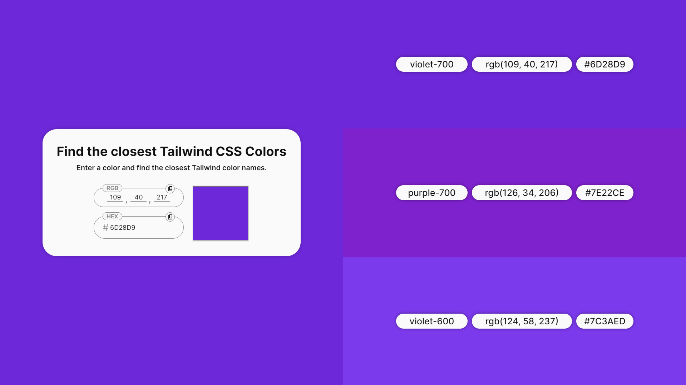

<h1 align="center">Find the Closest Tailwind Colors</h1>

  
  
  
  

  <a href="#-technologies">Technologies</a>&nbsp;&nbsp;&nbsp;|&nbsp;&nbsp;&nbsp;
  <a href="#-project">Project</a>&nbsp;&nbsp;&nbsp;

 

  

<h4 align="center">
  
  [See the project](https://gabrielcenteiofreitas.github.io/FindTheClosestTailwindColors/)
</h4>

 

## 🚀 Technologies

This project was developed using the following technologies:

- HTML
- CSS
- Javascript

## 💻 Project

"Find the closest Tailwind CSS colors" is a tool every Tailwind developer needs. Developed with the purpose of eliminating doubt when choosing which Tailwind color is most similar to the one used in the project.

Easy and intuitive, in that website you can input a color in Hex/RGB code or select it from a color picker and get the nearest colors from the Tailwind palette instantly.

## 🤝 Contributions

Issues and pull requests are appreciated!

## 👨🏻‍💻 Author: Gabriel Centeio Freitas 

  
  

